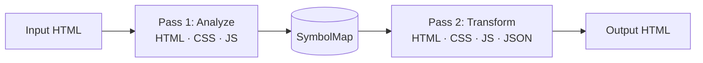

# ssukka

> **쓰까(ssukka)** is Busan dialect (부산 사투리) for "mix it up" (섞어).

HTML obfuscation library and CLI for Rust. Renders identically in browsers but is hard for humans to read.

## Features

- **Class/ID renaming** — consistent across HTML, CSS, and JavaScript (including dynamic construction patterns)
- **HTML entity encoding** — text and attribute values encoded as decimal/hex/named entities
- **Tag case randomization** — `<div>` becomes `<DiV>`
- **Attribute shuffling** — randomized attribute order
- **CSS minification** — via [lightningcss](https://github.com/nicbarker/lightningcss)
- **CSS selector unicode escaping** — `.foo` becomes `.\66\6f\6f`
- **JS string encoding** — string literals encoded as `\xHH` / `\uXXXX`
- **JS minification** — comment removal and whitespace compression
- **Comment removal** and **whitespace collapsing**
- **Deterministic output** — seed-based RNG for reproducible results

## Architecture

Two-pass streaming with [lol_html](https://github.com/cloudflare/lol-html):



## Installation

```bash
cargo install ssukka
```

Or build from source:

```bash
git clone https://github.com/miniex/ssukka.git
cd ssukka
cargo build --release
```

## CLI Usage

```bash
# Basic
ssukka -i input.html -o output.html

# stdin/stdout
cat input.html | ssukka > output.html

# With options
ssukka -i input.html -o output.html --seed 42 --no-rename --no-minify-css
```

### Options

| Flag | Description |
|------|-------------|
| `-i, --input <FILE>` | Input HTML file (default: stdin) |
| `-o, --output <FILE>` | Output file (default: stdout) |
| `--seed <N>` | Seed for deterministic output |
| `--no-rename` | Disable class/ID renaming |
| `--no-minify-css` | Disable CSS minification |
| `--no-minify-js` | Disable JS minification |
| `--no-encode-entities` | Disable entity encoding |
| `--no-shuffle-attrs` | Disable attribute shuffling |
| `--no-randomize-case` | Disable tag case randomization |

## Library Usage

```rust
// Simple
let result = ssukka::obfuscate(html)?;

// With configuration
let result = ssukka::Obfuscator::builder()
    .seed(42)
    .rename_classes(true)
    .rename_ids(true)
    .encode_text_entities(true)
    .minify_css(true)
    .build()
    .obfuscate(html)?;
```

## Limitations

- JS obfuscation is basic (string encoding + minification). For advanced JS obfuscation, use a dedicated tool.
- Dynamic class/ID construction in JS is handled via prefix detection heuristics, but highly dynamic patterns may not be caught.
- External stylesheets and scripts are not processed.

## License

MIT
